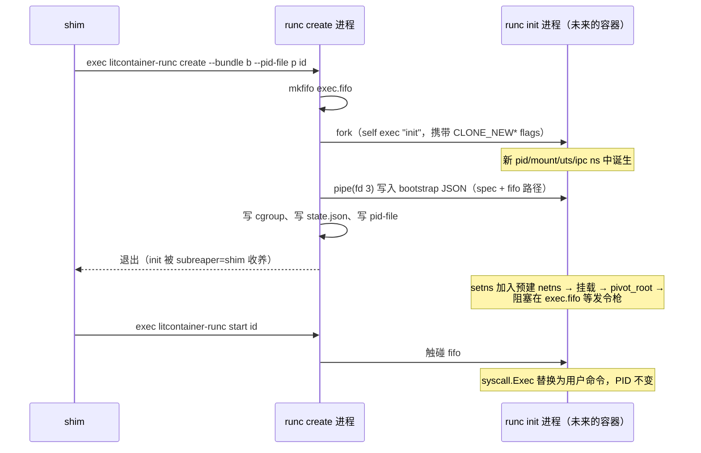
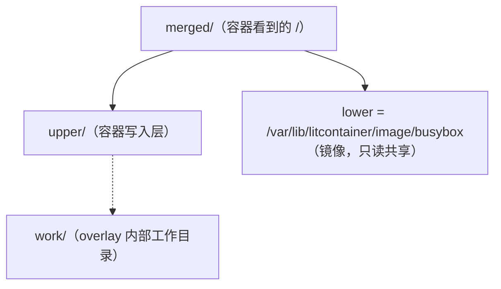
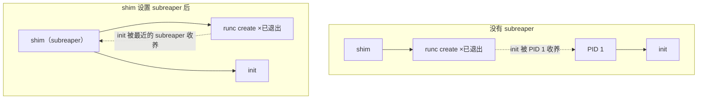
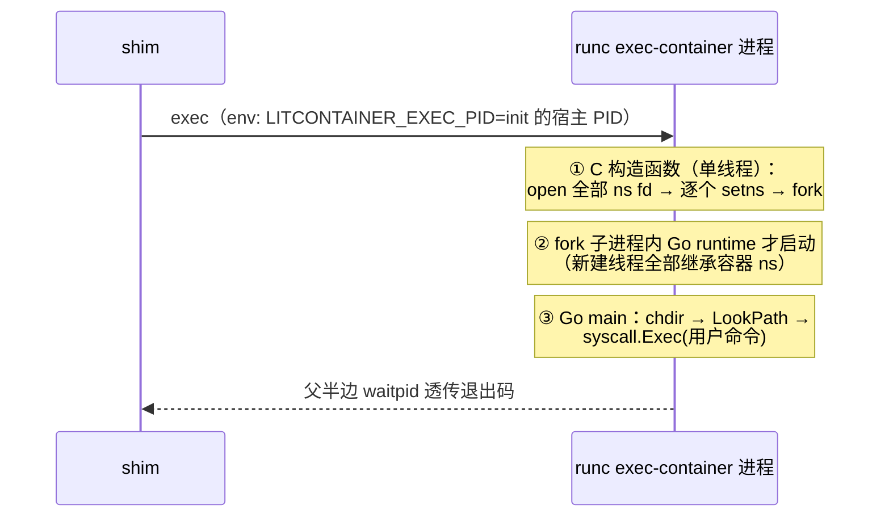

>🐣 作者水平有限，内容仅供参考，如有错误欢迎评论指出。
>
> 本文是 litcontainer 系列第二篇，聚焦最底层的 `litcontainer-runc`：一个容器进程是怎么被"隔离"出来的，以及 `exec` 。litcontainer-runc 是照着 runc 的骨架实现的简化版，本文会逐点对照 runc 的真实做法——哪些地方我们做得一样，哪些地方 runc 复杂得多、为什么。

容器的本质是**一个被 Namespace 隔离视图、被 cgroup 限制资源、被 pivot_root 切换了根文件系统的普通 Linux 进程**。下面按创建一个容器的真实执行顺序进行拆解。

## 一、runc 的进程编排：create / init / start 

`litcontainer-runc create` 并不直接变成容器进程，而是一套父子进程接力：



### 1.1 clone flags：namespace 在 fork 的一瞬间诞生

```go
initCmd := exec.Command(self, "init")
initCmd.SysProcAttr = &syscall.SysProcAttr{
    Cloneflags: syscall.CLONE_NEWPID | syscall.CLONE_NEWNS |
        syscall.CLONE_NEWUTS | syscall.CLONE_NEWIPC, // network 走 setns
}
```

Go 的 `exec.Command` 底层是 `clone()`，携带 `CLONE_NEW*` flags 时子进程一出生就在新 namespace 里。注意 **PID namespace 的特殊性**：新 pidns 只对"clone 出的子进程"生效。

> **对照 runc**：这是本项目与 runc 差异最大的一处。真实 runc 的 create 不是一次 Go clone 搞定的，而是经过 `nsexec.c` 的**三阶段 C 引导**（stage-0 父进程、stage-1 中间进程、stage-2 最终 init）。为什么这么绕？两个原因：
> ① Go runtime 多线程，无法安全地在 Go 代码里 fork 后做复杂操作，namespace 操纵必须在 Go runtime 启动前的 C 代码里完成；
> ② user namespace 的加入/创建与 uid/gid mapping 有严格的顺序依赖，需要中间进程配合。
> litcontainer 不支持 user namespace，所以 Go 的 `Cloneflags` 一步到位就够了。runc 里那套 C 引导技术我们最终也没绕开：exec 功能中结合CGO来实现（见第五节）。

### 1.2 exec.fifo：create 与 start 之间的阻塞管道

init 完成所有环境准备后需要停下来等 start 指令。litcontainer 用一个命名管道实现：

```go
// init 侧：以 O_RDWR 打开 fifo（open 不阻塞）
file, _ := os.OpenFile(fifoPath, os.O_RDWR, 0)
// ...完成 mount/pivot_root 后...
file.Read(buf)  // 阻塞在 Read 上，直到 start 写入
```

FIFO 的打开语义：`O_RDONLY` 阻塞等待写者，`O_WRONLY` 阻塞等待读者，而 **`O_RDWR` 打开不阻塞**。init 用 O_RDWR 打开就不必等 start 进程出现，先把环境准备完再阻塞在 `Read` 上；start 那边 `O_WRONLY` 打开（此时读者已存在，不会阻塞）写一个字节即完成发令。


阻塞解除后 init 调 `syscall.Exec`——**同一个 PID 上把进程映像替换为用户命令**。容器 init 的 PID 从 clone 那一刻起从未变过，变的只是执行的代码。

### 1.3 网络 namespace：预建 + setns 加入

网络配置（分 IP、建 veth、写 iptables）是 daemon 的业务，但 namespace 的创建时机在 runc。litcontainer 采用 Docker 的方案解耦：**daemon 先建好 netns，runc init 用 setns 加入**。

daemon 侧创建 netns 的代码有个必须注意的点：

```go
go func() {
    runtime.LockOSThread() // 关键！
    syscall.Unshare(syscall.CLONE_NEWNET)
    // 把当前线程的 netns bind mount 出来，变成有名字的持久 netns
    syscall.Mount("/proc/thread-self/ns/net", nsPath, "", syscall.MS_BIND, "")
}()
```

**namespace 是"每线程"属性而不是"每进程"属性**。Go runtime 会把 goroutine 随意调度到不同 OS 线程上，如果不 `LockOSThread`，`Unshare` 改的是线程 A 的 netns，下一行 mount 可能已经跑在线程 B 上了。锁住线程、干完活让 goroutine 退出（Go 会销毁被锁定的线程而不是放回线程池），宿主机不受污染。

bind mount `/proc/thread-self/ns/net` 的意义：namespace 是内核对象，只要有进程在其中或有文件引用它就不会销毁。线程退出后，靠这个 bind mount 文件"锚住" netns 不被回收——`ip netns add` 也是这个原理。

之后 daemon 把 netns 路径写进 OCI spec，runc init 看到带 path 的 namespace 就 `setns` 加入而非新建：

```json
{ "namespaces": [ { "type": "network", "path": "/run/litcontainer/netns/<id>" } ] }
```

> **对照 Docker**：一模一样的机制。libnetwork 创建 sandbox 时把 netns 文件放在 `/var/run/docker/netns/` 下，路径注入 OCI spec。"网络归 daemon、namespace 加入归 runc"这条职责分界线是从 Docker 原样搬来的。

## 二、rootfs：OverlayFS 与 pivot_root

### 2.1 OverlayFS：镜像只读、容器可写



```go
mountOption := fmt.Sprintf("lowerdir=%s,upperdir=%s,workdir=%s", lower, upper, work)
syscall.Mount("overlay", mergedDir, "overlay", 0, mountOption)
```

lower 层是解压后的镜像，**多个容器共享同一份**；每个容器的写入进 upper 层。删文件通过 whiteout 标记，改文件触发 copy-up。`export` 命令把 merged 视图 tar 出来，就得到"容器当前文件系统"的新镜像。

生命周期上：lower/upper/work 在 create 时准备（持久），merged 的**挂载**在 start 时执行、stop 时卸载（运行时）——所以停止的容器数据还在，再次 start 重新挂载即可。

> **对照 Docker overlay2**：原理相同，工程复杂一个量级。Docker 的镜像是多层的，overlay2 驱动把整条 layer 链拼成 `lowerdir=l1:l2:l3:...`（可达上百层）；由于 mount 选项有长度上限，Docker 还专门用 `l/` 目录下的短符号链接来缩短路径。litcontainer 的镜像就是一个 tar，单 lower 层——等于把 layer 链退化成了链长为 1 的特例。镜像分层、manifest、registry 协议是本项目明确没做的部分。

### 2.2 pivot_root：比 chroot 更彻底的换根

init 在容器的 mount namespace 内执行换根，完整序列：

```go
// 1. 阻断挂载传播：把 / 递归设为 private
//    systemd 系统默认 / 是 shared，容器内的 mount 会传播回宿主机
syscall.Mount("", "/", "", syscall.MS_PRIVATE|syscall.MS_REC, "")

// 2. rootfs bind mount 自己——pivot_root 要求 new_root 必须是挂载点
syscall.Mount(rootfs, rootfs, "bind", syscall.MS_BIND|syscall.MS_REC, "")

// 3. 挂载容器内的 /proc、/dev、volume（此时还看得见宿主机路径）
mountSpec(rootfs, spec.Mounts)

// 4. 换根
os.Mkdir(rootfs+"/.pivot_root", 0755)
syscall.PivotRoot(rootfs, rootfs+"/.pivot_root") // 新根上位，旧根挂到 .pivot_root
syscall.Chdir("/")

// 5. 踢掉旧根——从此宿主机文件系统在容器内彻底不可达
syscall.Unmount("/.pivot_root", syscall.MNT_DETACH)
os.RemoveAll("/.pivot_root")
```

为什么不用 chroot？chroot 只改变路径解析的起点，旧根还在挂载树里，有多种知名的逃逸手法；pivot_root 是**把整个挂载树的根换掉再卸载旧根**，配合 mount namespace 才是真正的文件系统隔离。

第 1 步不设 private 的话，容器内挂的 /proc 会出现在宿主机的挂载表里，所以为了避免子进程的挂载数据残留在父进程中需要先阻断传播。

## 三、cgroup v2：资源限制

cgroup v2 统一了 v1 的多层级混乱，一个容器一个目录：

```
/sys/fs/cgroup/litcontainer-<id>.scope/
├── cgroup.procs   # 写入 PID 即纳管
├── memory.max     # 内存上限（字节）
└── cpu.max        # "quota period"，如 "50000 100000" = 0.5 核
```

全部操作就是写文件：

```go
os.WriteFile(path+"/cgroup.procs", []byte(strconv.Itoa(pid)), 0644)
os.WriteFile(path+"/memory.max", []byte("104857600"), 0644)      // -m 100m
os.WriteFile(path+"/cpu.max", []byte("50000 100000"), 0644)      // --cpus 0.5
```

时序上注意：`runc create` 在 init 还阻塞于 exec.fifo 时就把它的 PID 写入 cgroup.procs——**限制先于业务代码生效**，容器业务的第一条指令就已经在管控之内。


## 四、shim：容器运行时的管理

这是整个进程模型里最精巧的一段。矛盾在于：

- init 是 **runc create 进程** clone 出来的，父进程是 runc create；
- runc create 干完就退出了；
- 按 Linux 规则，孤儿进程被重新指派给 PID 1；
- 但需要收割 init、拿退出码的是 **shim**。

解法是 `prctl(PR_SET_CHILD_SUBREAPER)`：



进程标记自己为 subreaper 后，**它的后代进程变成孤儿时会被它收养**，而不是一路上抛到 PID 1。于是 runc create 退出后 init 落入 shim 手中，shim 的 `wait4(initPid)` 才能等到退出事件：

```go
syscall.Syscall6(syscall.SYS_PRCTL, uintptr(syscall.PR_SET_CHILD_SUBREAPER), 1, 0, 0, 0, 0)
// ...runc create 完成后...
syscall.Wait4(initPid, &ws, 0, nil) // EINTR 重试循环
code := ws.ExitStatus()             // Signaled 时为 128+sig，unix 惯例
```


而 shim 自己脱离 daemon 用的是经典 **double-fork**：daemon fork 出一代 shim，一代设置环境变量后立刻 re-exec 自己成二代并退出；二代成为孤儿被收养，再 `setsid` 建独立会话。自此 daemon 与 shim 只剩 socket 之约，无父子之名——daemon 崩溃重启，容器不受影响。
## 五、exec：进入一个已存在的容器

`litcontainer exec` 要在**已有的** namespace 里跑新进程，用 `setns` 加入。但两个内核限制让纯 Go 实现走不通：

**限制一：setns(CLONE_NEWPID) 不改变调用者自己**。加入 pidns 只对"之后 fork 的子进程"生效——所以 setns 后必须再 fork 一次。

**限制二：mount namespace 是每线程属性，而 Go runtime 天生多线程**。Go 程序一启动，调度器就创建了多个 OS 线程；在某个 goroutine 里 setns 只改一个线程，其余线程还在宿主机 namespace，程序行为立刻错乱。必须**赶在 Go runtime 启动之前、进程还是单线程时**完成 setns。

"在 Go 代码运行前执行"——答案是 CGO 的构造函数。

```c
// cmd/litcontainer-runc/nsenter_linux.go 中的 C 代码
__attribute__((__constructor__)) static void nsenter_init(void) {
    const char *pid_str = getenv("LITCONTAINER_EXEC_PID");
    if (pid_str == NULL) return;   // 没设环境变量：普通 runc 调用，直接放行

    // 阶段一：趁还在宿主机 mount ns，把 5 个 ns fd 全部 open 出来
    //（一旦 setns 进容器 mnt ns，/proc/<pid>/ns/* 路径就解析不到了）
    for (i = 0; i < 5; i++)
        fds[i] = open("/proc/<pid>/ns/<name>", O_RDONLY);

    // 阶段二：逐个 setns（mnt/uts/ipc/net/pid）
    for (i = 0; i < 5; i++) setns(fds[i], flags[i]);

    // 阶段三：为 pidns 生效而 fork；父进程 waitpid 透传退出码
    pid_t child = fork();
    if (child > 0) { waitpid(child, &status, 0); exit(WEXITSTATUS(status)); }
    // 子进程：已在容器全部 ns 内，继续启动 Go runtime
}
```

执行顺序值得单独画出来：



两个容易忽略的细节：

- **先 open 全部 fd，再逐个 setns**：setns(mnt) 之后文件系统视图变成容器的，`/proc/<pid>/ns/...` 里的 pid 是宿主机 pid，在容器 pidns 视角下根本不存在。fd 一旦打开就与路径无关，所以先打开。

## 六、小结：与 runc 对照速查

| 机制          | runc 的做法                               | litcontainer 的做法                           |
| ----------- | -------------------------------------- | ------------------------------------------ |
| create 进程引导 | nsexec.c 三阶段 C 引导 + netlink 配置         | Go Cloneflags 一次 clone（不支持 userns 才可行）     |
| netns       | 上层预建 + spec path 注入 setns              | 相同（daemon 直建）                              |
| 存储驱动        | 上层（Docker overlay2 多层 lower + 短链接）     | 单 lower 的 overlay，退化特例                     |
| cgroup      | v1/v2 双支持，cgroupfs/systemd 双驱动         | 仅 v2 + 直写 cgroupfs                         |
| exec 入舱     | nsexec constructor + netlink 传参 + 安全收尾 | CGO constructor + 环境变量传 PID，无 seccomp/caps |

这些机制没有一个是 Docker 发明的——全部是 Linux 内核的既有能力。容器引擎的工程价值在于把它们编排成可靠、可恢复、边界清晰的系统。
