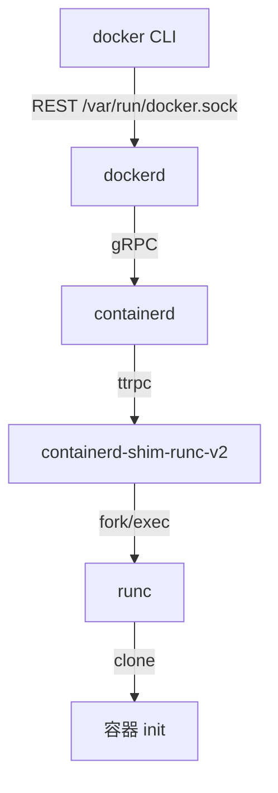
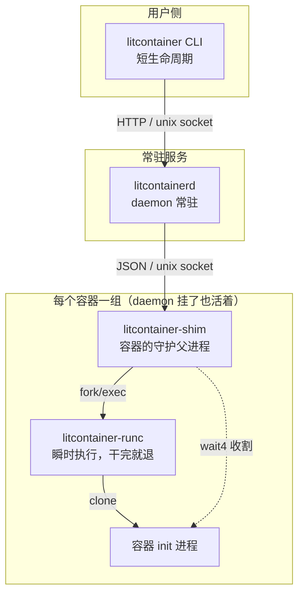
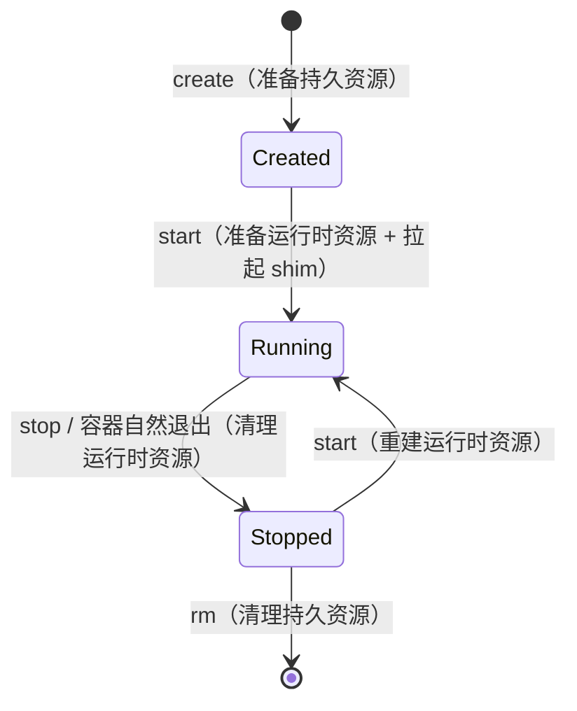
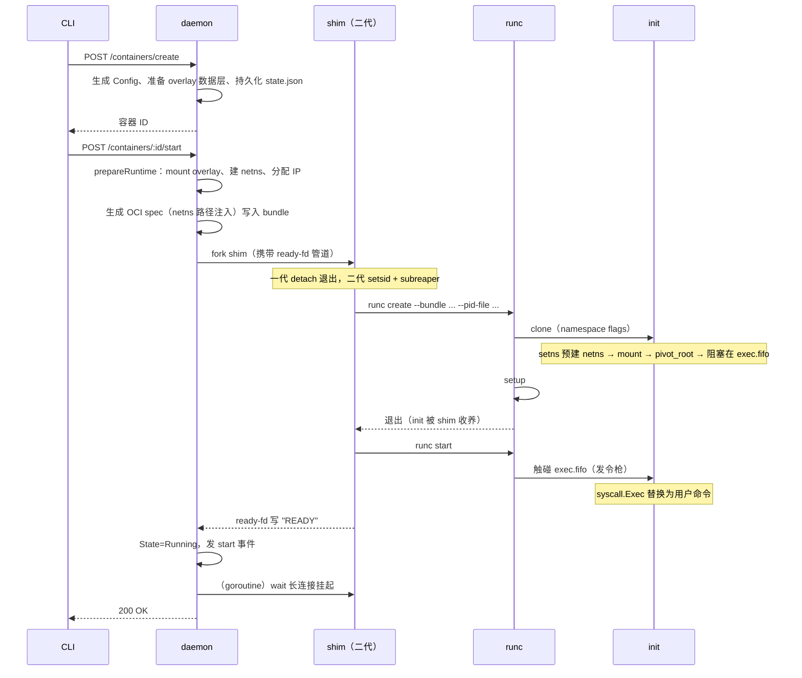
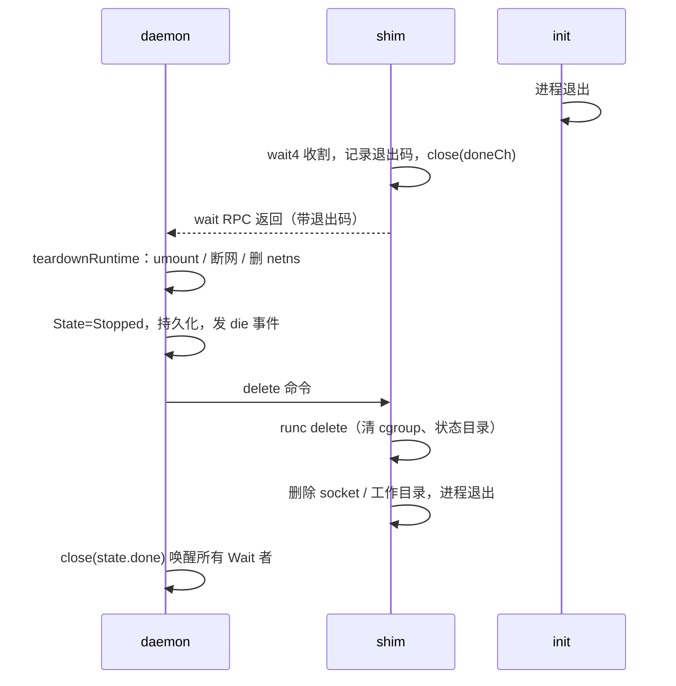

>🐣 作者水平有限，内容仅供参考，如有错误欢迎评论指出。
>
> litcontainer 是笔者为了搞懂 Docker 内部原理而从零实现的容器运行时，架构上尽量向 Docker / containerd / runc 对齐。本文是系列第一篇，讲整体架构：容器引擎为什么要拆成多个进程、每个进程的职责边界在哪、一个容器从 create 到 rm 的完整生命周期是如何流转的。每个关键设计点都会对照真实 Docker 的做法，方便对比记忆。

## 一、为什么要拆成多个进程？

初学容器时最直觉的实现是"一个程序做完所有事"：解析命令 → clone 出隔离进程 → 挂载 rootfs → 等待退出。litcontainer 的早期版本就是这样。但这个模型有几个致命问题：

1. **CLI 退出容器就死**：容器进程是 CLI 的子进程，CLI 一退出（或被 Ctrl-C），容器跟着被收割；
2. **没有统一的状态视图**：多个 CLI 进程各管各的容器，`ps` 没有权威数据源；
3. **升级/崩溃牵连**：管理进程崩了，所有容器陪葬。

### 1.1 Docker 五层架构

真实 Docker 的调用链是五层：



其中 containerd 这一层是历史演化的产物：它从 dockerd 中拆出，专注"容器运行时管理"（task/镜像/快照），使得 Kubernetes 可以绕过 dockerd 直接对接 containerd（CRI），也让 dockerd 升级不影响容器。

### 1.2 litcontainer 四层架构

litcontainer 省略了 containerd，由 daemon 直接管理 shim：



| litcontainer | 对应 Docker 组件 | 职责 |
|---|---|---|
| `litcontainer` | `docker` CLI | 参数解析 + HTTP 调用，无状态 |
| `litcontainerd` | `dockerd`（+ 部分 containerd 职责） | 编排：状态机、持久化、网络、事件；**不直接接触容器进程** |
| `litcontainer-shim` | `containerd-shim-runc-v2` | 容器 init 的父进程：收割退出码、转发 IO、执行 stop/kill/exec |
| `litcontainer-runc` | `runc` | 底层运行时：真正调 clone/setns/pivot_root，创建完就退出 |

这个拆分带来的关键能力：

- **daemon 重启不影响容器**：容器的父进程是 shim 而不是 daemon；
- **runc 无状态、可替换**：runc 只认 bundle 目录里的 `config.json`（OCI spec）；
- **shim 极简可靠**：代码量小、不依赖 daemon，是"容器活着"的最低保障。

> **对照 Docker**：值得一提的是，dockerd 重启后容器存活在 Docker 里**不是默认行为**——需要显式开启 `live-restore: true`，否则 daemon 停止时会连带停掉所有容器。litcontainer 把"重连存活容器"做成了默认逻辑（见 4.3 节 reconcile），行为上更接近 containerd 对 shim 的管理方式。

### 1.3 OCI与config.json文件

**OCI 是"容器与镜像长什么样"的标准家族**，包含三份规范：runtime-spec（bundle 与 config.json 的格式、create/start/kill/delete 的语义，runc 是参考实现）、image-spec（镜像的 manifest 与 layer 格式）、distribution-spec（registry 的 pull/push 协议）。

litcontainer 里，daemon 维护的 `state.json` 记录**用户意图**：镜像名、网络名、端口映射、"100m" 这样的原始限制写法——对应 Docker 的 `config.v2.json` / `hostconfig.json`；而 bundle 里的 `config.json`（OCI runtime-spec）记录**内核执行计划**：rootfs 的绝对路径、netns 的文件路径、cgroup 目录、换算成字节的 resources——这是 runc 唯一读取的文件，它不知道也不需要知道"镜像"和"网络"是什么。

## 二、每个进程内部长什么样

### 2.1 daemon：编排核心

daemon 是唯一常驻且有全局视图的进程，内存里维护一张容器表：

```go
type Daemon struct {
    mu         sync.RWMutex
    containers map[string]*ContainerState
    netCtrl    *network.Controller
    bus        *events.EventBus
}

type ContainerState struct {
    Config *container.Config // 持久化配置（state.json 的内存镜像）
    done   chan struct{}     // 容器退出信号（close 即退出）
    opMu   sync.Mutex        // 每容器生命周期操作串行化
}
```

三个并发原语各管一件事：

- **`d.mu`**（全局读写锁）：保护 containers map 本身与 Config 字段读写；
- **`opMu`**（每容器互斥锁）：把同一容器的 start/stop/kill/rm 串行化，防止"两个 start 同时执行、各自建 netns"这类竞态；
- **`done` channel**：`ContainerWait`、`ContainerStop` 都靠 `<-state.done` 等待容器真正清理完毕，close 一次广播所有等待者。

持久化方式是每容器一个 JSON 文件（`/var/lib/litcontainer/container/<id>/state.json`）。

> **对照 Docker**：dockerd 的做法几乎一样——每个容器在 `/var/lib/docker/containers/<id>/` 下有 `config.v2.json` 和 `hostconfig.json`，同样是**文件即数据库**。而 containerd 层用的是 BoltDB。litcontainer 的**网络元数据**用了 BoltDB（`local-kv.db`，这个文件名就是从 Docker libnetwork 抄来的），所以两种持久化风格本项目都碰到了。
> 
>架构上：containerd北向实现CRI接口和客户端工具，核心组件有Content（内容管理）、Image（镜像管理）、Snapshot（快照管理，为容器提供可写的读写层）Container（容器元数据）、Task（任务）。litcontainerd架构上没有明确分离，具备内容管理，元数据管理容器运行的基本功能。

**关键设计：运行时状态不落在 daemon**。`ps` / `inspect` 显示的 PID 和运行状态是实时向 shim 查询的，daemon 的 `Config.State` 只是粗粒度的生命周期标记。单一事实源在 shim，避免双写不一致——Docker 同样如此，`docker inspect` 里的 `State.Pid` 来自 containerd 的 task 查询链路，而非 dockerd 缓存。

### 2.2 shim：容器的守护父进程

shim 启动即做几件对可靠性至关重要的事：

1. **double-fork 脱离 daemon**，与 daemon 解除父子关系；
2. **setsid** 建立独立会话，隔离shim与daemon，从而隔离daemon对容器的影响；
3. **`PR_SET_CHILD_SUBREAPER`**：让 runc create 退出后，容器 init 被 shim 收养，shim 才能 `wait4` 它；
4. 监听 `shim.sock`，向 daemon 提供协议服务：`state / stop / wait / kill / delete / exec`。

> **对照 containerd-shim**：职责完全对应，但有三点实现差异值得记住。
> ① **协议**：containerd-shim 用 ttrpc（为嵌入式场景裁剪的轻量 gRPC，去掉了 HTTP/2），litcontainer 用换行分隔的 JSON——语义相同，工程强度不同；
> ② **启动握手**：containerd 调 `shim start` 子命令，shim 把自己的 socket 地址**打印到 stdout** 返回给 containerd；litcontainer 是 daemon 先约定好 socket 路径，shim 用一根 pipe（ready-fd）回写 READY 确认（见 4.1）；
> ③ **粒度**：shim v2 支持一个 shim 进程服务一个 Pod 内多个容器（k8s 场景省进程），litcontainer 严格一容器一 shim。

### 2.3 runc：create 与 start 分离

OCI 运行时把"创建"和"启动"拆成两步，litcontainer 完整复刻：

- **`runc create`**：clone 出 init 进程、配置 cgroup，init 在容器内完成 mount/pivot_root 后**阻塞在一个 FIFO 上等待发令枪**；
- **`runc start`**：触碰 FIFO，init 解除阻塞，`syscall.Exec` 替换为用户命令。

这个分离让"环境就绪"和"业务启动"之间可以插入任意准备工作（网络配置、hook 执行），也正是 `docker create` / `docker start` 两个命令的由来。FIFO 同步的具体实现与 runc 有个方向上的有趣差异，放在第二篇细讲。

## 三、状态机与资源边界

### 3.1 三态状态机



> **对照 Docker**：Docker 的状态机更丰满——`created / running / paused / restarting / exited / dead / removing`。litcontainer 没做的 paused 对应 cgroup freezer，restarting 对应 restart policy，dead 对应"清理失败的僵尸状态"。三态是它的最小核心子集，其余状态都是在这个骨架上按需生长出来的。

### 3.2 持久资源 vs 运行时资源

支撑这个状态机的是一条清晰的资源分界线——这是 Docker `create/start/stop/rm` 四动词语义的根基：

| 资源 | 类别 | 创建时机 | 销毁时机 |
|---|---|---|---|
| bundle 目录（config.json / state.json） | 持久 | create | rm |
| overlay 数据层（lower/upper/work） | 持久 | create | rm |
| overlay **merged 挂载** | 运行时 | start | stop |
| netns / veth / IP / iptables 规则 | 运行时 | start | stop |
| shim 进程与工作目录 | 运行时 | start | stop（shim 自清理） |
| runc 状态目录、cgroup scope | 运行时 | start | stop |

`create` 只写元数据和解压镜像（不挂载、不分配 IP）；`start` 才"上电"；`stop` 把运行时资源全部拆掉但保留数据层——所以停止的容器能再次 `start`，且 upper 层的文件改动还在。`docker create` 同样不挂 rootfs、不分配 IP，这一点笔者最初的实现是错的（create 时就 mount overlay），重构成 Docker 语义后，"stop 后再 start"这条路径才真正跑通。

代码上这条线体现为 daemon 里一对对称的方法：

```go
prepareRuntime(state)   // mount overlay + create netns + connect network
teardownRuntime(state)  // umount overlay + disconnect + remove netns（幂等）
```

start 失败的回滚、stop 的清理、daemon 重启发现容器已死的兜底清理，全部复用 `teardownRuntime`——清理逻辑只有一份。

## 四、litcontainer容器生命周期

### 4.1 create + start 时序



几个值得注意的细节：

- **READY 握手**：daemon 用一根 pipe（fd 3 传给 shim）等 shim 报告就绪，5 秒超时。daemon 起完 shim 后**立刻关闭自己持有的写端**——否则 shim 异常死亡时 pipe 不会 EOF，daemon 只能干等超时。containerd 对应的机制是 `shim start` 的 stdout 返回 socket 地址，思路一致：**创建者必须有一个同步点确认 shim 可用，且这个同步点要能感知 shim 的死亡**。
- **netns 先建后注入**：网络属于 daemon 的业务（IPAM、iptables），不下放给 runc。daemon 预先创建 netns 并 bind mount 到 `/run/litcontainer/netns/<id>`，把路径写进 spec 的 `namespaces[network].path`，init 用 `setns` 加入而非新建。Docker 完全同理：libnetwork 创建 sandbox（netns 文件在 `/var/run/docker/netns/`），路径注入 OCI spec。
- **daemon 对容器的"监听"是一条阻塞 RPC**：daemon 起一个 goroutine 调 shim 的 `wait` 命令，这条连接一直挂到 init 退出。containerd 里对应的是 Task 服务的 `Wait` 调用加事件订阅。

### 4.2 容器退出与清理



顺序上有讲究：**shim 是等 daemon 的 delete 指令才退出的**，而不是 init 一死就自行清理。daemon 的清理（umount、网络回收）需要 shim 活着提供最后的状态查询，daemon 清完才"批准" shim 善后退出。这与 containerd 的 task delete 语义一致——shim 的退出永远由上层显式触发。

`stop` 只是这条链路的主动触发版本：daemon 向 shim 发 `stop{signal, timeout}`，shim 给 init 发 SIGTERM，超时未退再补 SIGKILL（默认 10 秒，与 `docker stop -t` 的默认值一致），后续流程与自然退出完全相同。

### 4.3 daemon 重启：reconcile

daemon 启动时对每个标记为 Running 的容器做重连：

```go
func (d *Daemon) reconcileContainer(state *ContainerState) {
    cli := shim.NewShimClient(state.Config.ID)
    if _, err := cli.State(); err != nil {
        // shim 不通：容器已死，走一遍 teardownRuntime 兜底清理
        d.cleanupContainer(state)
        return
    }
    // shim 还活着：重建 done channel，重新挂 wait 长连接
    state.done = make(chan struct{})
    go d.waitContainerBySocket(state)
}
```

能这么做的前提正是前面的架构决策：shim 与 daemon 无父子关系、shim socket 路径可由容器 ID 推导、运行时状态的事实源在 shim。daemon 只是"重新订阅"，不需要恢复任何运行时内存状态。

> **对照 Docker**：这对应 dockerd 的 live-restore 特性 + containerd 启动时对 shim 的重连。Docker 里这条链路更长：dockerd 重启 → 重连 containerd → containerd 按 BoltDB 里的记录重连各 shim socket。litcontainer 因为少一层，reconcile 是 daemon 直连 shim 一步到位。

## 五、进程间通信矩阵

| 链路 | litcontainer | Docker 对应 |
|---|---|---|
| CLI ↔ daemon | HTTP over unix socket（REST + chunked + hijack） | 相同（Docker Engine API） |
| daemon ↔ shim | 换行分隔 JSON over unix socket | dockerd↔containerd 为 gRPC；containerd↔shim 为 ttrpc |
| shim ↔ runc | fork/exec + 命令行 + pid-file + exec.fifo | 相同 |
| runc ↔ init | pipe 传 bootstrap + exec.fifo | runc 用 `_LIBCONTAINER_INITPIPE` + netlink 消息，思路相同 |

IO 与流式协议（stdcopy、hijack、事件总线）见[第三篇](litcontainer（三）：IO%20与通信协议.md)；namespace/cgroup/pivot_root 等底层机制见[第二篇](litcontainer%20（二）：运行时原理%20——%20Namespace、pivot_root、cgroup%20与%20exec.md)。

## 六、小结：与 Docker 对照速查

| 设计点 | Docker / containerd | litcontainer |
|---|---|---|
| 进程链 | CLI → dockerd → containerd → shim → runc（五层） | CLI → daemon → shim → runc（四层，省 containerd） |
| daemon 重启容器存活 | 需开启 live-restore | 默认行为（reconcile） |
| shim 协议 | ttrpc | 换行分隔 JSON |
| shim 就绪握手 | `shim start` stdout 返回 socket 地址 | ready-fd pipe 写 READY |
| shim 粒度 | v2 可一 shim 服务一 Pod | 严格一容器一 shim |
| 容器状态数 | 7 态（含 paused/restarting/dead） | 3 态核心子集 |
| 容器配置持久化 | config.v2.json 文件 | state.json 文件（同风格） |
| stop 语义 | SIGTERM → 10s 超时 → SIGKILL | 完全相同 |
| netns 管理 | libnetwork 预建 + spec 注入 | 相同技术，daemon 直管 |

litcontainer 的架构核心：**进程拆分即故障域拆分；资源分持久与运行时两类，状态机因此简单可靠；运行时状态的事实源唯一且在 shim**。
