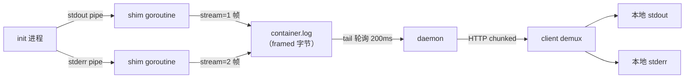
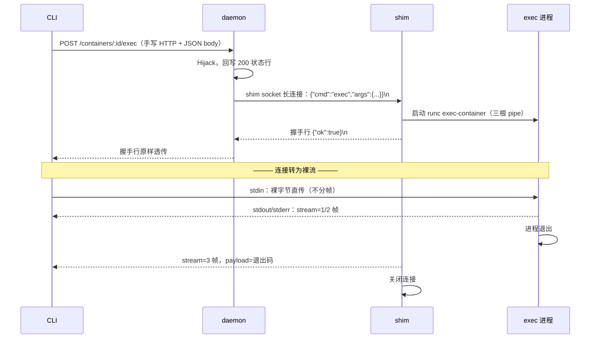

>🐣 作者水平有限，内容仅供参考，如有错误欢迎评论指出。


本文是 litcontainer 系列第三篇，讲"数据怎么流"：容器的 stdout/stderr 如何跨三个进程送到用户终端、`log -f` 为什么能一直挂着、`exec` 的双向流如何在 HTTP 上实现。

## 一、三种通信模式

litcontainer 的所有跨进程通信可以归纳为三种模式，复杂度递增：

| 模式         | 场景                         | client↔daemon 载体      | daemon↔shim 载体              |
| ---------- | -------------------------- | --------------------- | --------------------------- |
| **单次 RPC** | start/stop/kill/inspect... | HTTP 请求/响应（JSON）      | 短连接，一行 JSON 请求 + 一行 JSON 响应 |
| **单向流**    | `log -f`                   | HTTP chunked 编码       | logs 经文件中转                  |
| **双向流**    | `exec`                     | HTTP **Hijack** 后的裸连接 | 长连接，JSON 握手后转裸流             |

## 二、stdcopy：一条字节流上的多路复用

### 2.1 问题：一个文件装不下两条流

容器进程天然有两条输出流（fd 1 / fd 2）。若把它们粗暴地重定向进同一个日志文件，"哪行是 stdout、哪行是 stderr"这一信息就永久丢失了——`log 2>/dev/null` 这种需求做不了。

裸字节流没有结构，解法是给每段数据加标记——**framing（分帧）**。litcontainer 实现了与 Docker `pkg/stdcopy` **字节级兼容**的帧格式：

```
┌───────────┬─────────────┬──────────────────┐
│ stream(1B)│ reserved(3B)│ length(4B 大端)   │  ← 8 字节帧头
├───────────┴─────────────┴──────────────────┤
│              payload（length 字节）          │
└─────────────────────────────────────────────┘
stream: 0=stdin  1=stdout  2=stderr
```

例如容器输出 `hello\n` 到 stdout，流上实际是：

```
01 00 00 00 00 00 00 06 68 65 6c 6c 6f 0a
└stream┘ └reserved┘ └len=6┘ └─ "hello\n" ─┘
```

接收端循环"读 8 字节头 → 按 length 读 payload → 按 stream 分发"，即可无损还原两条流。`docker logs` 输出能用 `2>/dev/null` 过滤 stderr，靠的就是这个协议 + docker CLI 内置的 demux。

### 2.2 写端：并发下的帧完整性

shim 里 stdout/stderr 由两个 goroutine 并发写同一个文件，若不加控制，A 的帧头写到一半被 B 插入整帧，整个流就永久错位了。所以 mux 写入器内部用互斥锁保证**整帧原子写入**：

```go
func (s *streamWriter) Write(p []byte) (int, error) {
    header[0] = s.stream
    binary.BigEndian.PutUint32(header[4:], uint32(len(p)))
    s.mu.Lock()               // 帧头 + payload 持锁一次写完
    defer s.mu.Unlock()
    s.w.Write(header[:])
    s.w.Write(p)
    return len(p), nil        // 返回 len(p) 而非 len(p)+8：io.Copy 只认业务字节
}
```


## 三、流式日志：`log -f` 全链路

### 3.1 数据通路



分层要点：**framing 发生在 shim（写文件时已是帧），daemon 是完全不解析协议的透传管道，demux 发生在 client**。

> **对照Docker：** 本项目与Docker对日志的处理最大的差异是落盘格式，Docker落盘的每一行是一条JSON，例如`{"log":"hello\n","stream":"stdout","time":"2026-05-15T10:23:01.123Z"}`。dockerd响应logs时再按stdcopy帧传输。

### 3.2 shim 侧

shim 给 init 的 stdout/stderr 各接一根 pipe，有个必须处理的细节——**写端引用计数**：

```go
cmd.Stdout, cmd.Stderr = stdoutW, stderrW
cmd.Run()                       // runc create：init 通过 fork 继承了 W 端副本
stdoutW.Close()                 // 关键！shim 立刻放掉自己的 W 端引用
stderrW.Close()
go io.Copy(muxer.Stdout(), stdoutR)  // R 端归 goroutine 所有，由它 defer Close
go io.Copy(muxer.Stderr(), stderrR)
```

pipe 的 EOF 规则：**读端只有在写端引用计数归零时才返回 EOF**。此刻 W 端有两个引用（shim + init），shim 不主动 close 的话，将来 init 死了引用还剩 1（shim 自己那份），`io.Copy` 永远阻塞，goroutine 泄漏、日志断流。close 之后唯一持有者是 init——init 退出，pipe EOF，goroutine 自然收尾，不需要任何显式取消机制。

fd 的所有权规则值得一记：**谁长期持有 fd，谁负责 close**。R 端归 goroutine（函数内 defer close），W 端 shim 只短期持有（转交完立即 close），失败路径上 goroutine 没启动则由创建者兜底。

### 3.3 daemon 侧

`log` 不需要双向，普通 HTTP 就够——不设 `Content-Length`，Go 自动切换 `Transfer-Encoding: chunked`，服务端可以边读文件边发：

```go
for {
    n, rerr := f.Read(buf)
    if n > 0 { w.Write(buf[:n]) }           // w 是每次 Write 后立即 Flush 的包装
    if rerr == io.EOF {
        if !follow { return nil }            // 非 follow：读完即止
        if 容器已停止 { drain剩余字节; return nil }
        select {
        case <-ctx.Done(): return nil        // client 断开（Ctrl-C）
        case <-time.After(200 * time.Millisecond):
        }
    }
}
```

两个工程细节：

- **每次 Write 后必须 Flush**：Go 的 HTTP 响应默认攒 4KB buffer，不 Flush 的话 follow 模式延迟能到秒级。
- **流的结束不需要自己写协议**：handler return 后，Go 的 http.Server 自动写出 chunked 终止块 `0\r\n\r\n`；client 侧标准库的 chunkedReader 读到它就向上返回 `io.EOF`，demux 循环随之退出。**服务端"结束即 return"，客户端"读到 EOF 即完"，终止语义全由框架承担**。反方向同理：client Ctrl-C → conn 关闭 → server 把 request context 标记 Done → 轮询循环退出——两端各自 defer 清理，靠 conn 关闭与 ctx 取消互相通知。

>**对照Docker**：follow 的"感知文件有新内容"用 200ms 轮询实现；Docker 用的是 fsnotify（inotify）事件驱动 + 处理文件 rotation 的复杂逻辑。

## 四、exec：HTTP Hijack 与双向流

### 4.1 为什么 chunked 不够了

`exec` 需要把用户键盘输入送进容器（stdin），同时把容器输出送回来——**双向**。而 Go 的 `http.Client.Do` 是"请求体发完 → 拿响应"的模型，响应开始后没有渠道继续向服务端写字节。HTTP 语义本身装不下这个需求，必须把连接从 HTTP 框架手里"劫持"出来：

```go
hijacker, _ := c.Writer.(http.Hijacker)
conn, brw, _ := hijacker.Hijack()   // 从此这条连接归 handler 支配
conn.Write([]byte("HTTP/1.1 200 OK\r\nContent-Type: application/vnd.lit.exec-stream\r\n\r\n"))
// 之后 conn 上跑自定义协议，与 HTTP 再无关系
```

Hijack 后 gin/net.http 不再管这条连接：状态行要自己手写，客户端也不能用 `http.Client`（改为 `net.Dial` + 手写请求行 + 手动解析响应头）。这正是 `docker exec/attach` 的实现方式——Docker 的响应头是 `Content-Type: application/vnd.docker.raw-stream`（新版本 API 还支持 `Upgrade: tcp` 走 101 状态码），我们的 `application/vnd.lit.exec-stream` 就是照着这个命名习惯起的。

### 4.2 全链路协议



协议上的三个决策：

- **stdin 方向不分帧**：只有一条流，裸字节直传即可；返回方向有 stdout/stderr 两条才需要 stdcopy 帧。
- **JSON 握手先行**：业务失败（容器已停、命令为空）通过 `{"ok":false,...}` 一行返回，连接干净结束；握手成功后同一条连接切换为裸流。一条连接、两种协议阶段。
- **退出码作为流内帧**（stream=3）：shim 在 stdout/stderr 全部转发完后追加一个 exit 帧再关连接，client 的 demux 循环见到 stream=3 即取退出码返回——**流的终止靠语义帧而非 EOF**，EOF 反而是"没收到退出码就断了"的异常信号。

> **对照 Docker exec**：Docker 的 exec 是**三步 API**：
> ① `POST /containers/{id}/exec` 创建 exec 实例（返回 execID）；
> ② `POST /exec/{execID}/start` hijack 连接跑双向流；
> ③ 流结束后 `GET /exec/{execID}/json` 查 `ExitCode`。


## 六、小结：与 Docker 对照速查

| 设计点                   | Docker                              | litcontainer                          |
| --------------------- | ----------------------------------- | ------------------------------------- |
| stdout/stderr 帧格式     | pkg/stdcopy，8 字节头                   | **字节级兼容**，另扩展 stream=3 退出码帧           |
| 帧生成时机                 | 响应 API 请求时现场编码                      | shim 落盘时即编码（daemon 零转换）               |
| 日志落盘                  | json-file（带时间戳/rotation，driver 可插拔） | framed 裸字节文件（无时间戳/rotation）           |
| shim → 上层 IO 通道       | 命名 FIFO + copier                    | 文件中转                                  |
| log -f 实现             | fsnotify 事件驱动                       | 200ms 轮询                              |
| exec API 形态           | 三步（create/start/inspect），exec 是资源对象 | 一步 hijack，退出码内联流中（会话模型）               |
| hijack 流 Content-Type | application/vnd.docker.raw-stream   | application/vnd.lit.exec-stream（仿其命名） |
| TTY 模式                | 支持（pty，raw 流不分帧）                    | 未实现                                   |


系列到此完整覆盖了 litcontainer 的三层：架构与生命周期、底层运行时以及本文的 IO 协议。三者拼起来，就是一个麻雀虽小但五脏俱全的 Docker。
