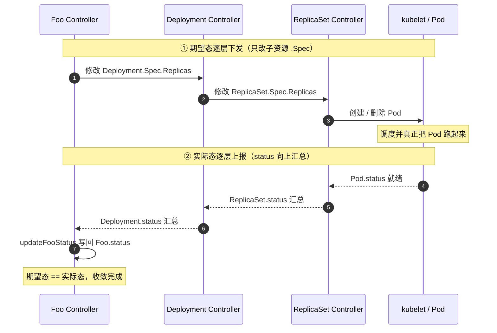

> 🐣 作者水平有限，内容仅供参考，如有错误欢迎评论指出。

# 引言

本文将从 sample-controller 入手，初步理解 Operator 以及 controller 的相关基础知识与原理。

---

# 基本概念

声明式 API 是 K8s 的交互模式与管理方法，也是整个系统的核心设计哲学。与传统的命令式 API 不同，我们不需要告诉 K8s「怎么做」，只需要告诉它「想要什么」。控制器会在控制循环（control loop）中，通过一系列操作，将**实际状态**不断拉齐到**期望状态**。

下面我们从设计角度出发，一步一步推导出一个相对完备的 controller，并在这个过程中理解 K8s controller 中 informer、workqueue、Lister 等相关概念。

控制器要完成的事，本质上就是让实际状态不断逼近期望状态。如果让我们自己来设计这个控制器，最直观的想法就是采用「循环 + 轮询」的方式，不断从 apiserver 获取期望状态（spec）。

```
while true:
    objs = apiserver.list(resourceType)  # 获取关注的资源 list
    for obj in objs:
        actual = actualResource          # 获取资源实际状态
        if actual != obj.spec:
            doSomething()                # 动手拉平
    sleep(1s)
```

这种实现方式虽然简单，但弊端也最明显：在大规模集群下，成千上万个 Pod、几十个 controller 都这么干，apiserver 根本无法支撑如此大的流量，轮询是不可接受的。

那怎么优化呢？可以基于**事件驱动**来设计：controller 与 apiserver 建立长连接，当 apiserver 收到某个资源的变更请求后，主动推送一个事件给 controller，这样就避免了轮询。

```
for event in apiserver.watch(Resource):
    obj = event.object
    actual = actualResource  # 获取资源实际状态
    if actual != obj.spec:
        doSomething()        # 动手拉平
```

这样虽然能让 apiserver 缓口气，但这种模式同时又引入了一些新问题：

1. 事件可能丢失；
2. 启动时存在数据待同步（首次启动没有历史事件可消费）；
3. doSomething 执行时可能失败。

为了解决上面的问题，其实可以把前面两种设计「缝合」一下：controller 启动前先请求 apiserver，获取一次资源的全量快照并在本地缓存，后续事件回调直接更新缓存，从而避免频繁读取 apiserver。

为了防止事件丢失，给事件加上 version：一旦发生事件丢失，controller 把当前持有的事件版本告知 apiserver，让 apiserver 从该版本开始把之后的事件补发过来，从而保证缓存一致；如果 controller 断联后重连、版本差异过大，则可以全量重新拉取缓存。最后，我们在流程上再加一个 workqueue，解决 doSomething 失败后的重试问题。

经过这样的改造，整个模型就变成了下面这样——这其实就是 informer 的雏形了，可以粗略理解为 **Informer = list + watch + cache**。

```
cache = apiserver.list(resourceType)  # 启动时获取全量资源并缓存

# 事件监听循环
while true:
    for event in apiserver.watch(resource):
        queue.Add(resourceName)

# 消费处理循环
while true:
    name = queue.Get()
    obj = cache.list(name)
    doSomething(obj)
    if fail:
        queue.AddRetry(name)  # 加入重试队列
```

以上就是一个简单 controller 模型的设计推导过程。当然，真正的 controller 不会如此简陋，上面还有诸如 reflector、deltaFIFO 等概念没有引入，但基于这个推导流程，我们已经能对 controller 的工作流程有一个基本的认识。


上面是一张 controller 的实际架构图，从箭头流向来看，整体流程与上面推导出的流程基本一致。

# sample-controller 代码解析

sample-controller 是官方提供的一个 Operator 示例，本文借助该项目来熟悉 controller 的工作原理与工作流程，[项目地址](https://github.com/kubernetes/sample-controller)。

## Informer + Lister

```go
controller := &Controller{
    kubeclientset:     kubeclientset,
    sampleclientset:   sampleclientset,
    deploymentsLister: deploymentInformer.Lister(),
    deploymentsSynced: deploymentInformer.Informer().HasSynced,
    foosLister:        fooInformer.Lister(),
    foosSynced:        fooInformer.Informer().HasSynced,
    // ...
}
```

实际上，client-go 已经把大部分工作封装好了：使用时通过 Informer 拿到 Lister，就可以直接从本地缓存读取对象的期望值。除此之外，上面还有一个 Synced（`HasSynced`），它是一个用于判断 Informer 本地缓存是否已完成首次全量同步的函数，用来保证 controller 启动时缓存已经就绪，避免拿到不完整的数据。

## EventHandler

```go
fooInformer.Informer().AddEventHandler(cache.ResourceEventHandlerFuncs{
    AddFunc: controller.enqueueFoo,
    UpdateFunc: func(old, new interface{}) {
        controller.enqueueFoo(new)
    },
})
// ...
deploymentInformer.Informer().AddEventHandler(cache.ResourceEventHandlerFuncs{
    AddFunc: controller.handleObject,
    UpdateFunc: func(old, new interface{}) {
        newDepl := new.(*appsv1.Deployment)
        oldDepl := old.(*appsv1.Deployment)
        if newDepl.ResourceVersion == oldDepl.ResourceVersion { return }
        controller.handleObject(new)
    },
    DeleteFunc: controller.handleObject,
})
```

可以看到，控制器分别为两个 Informer 注册了回调函数。因为这里的 CRD 资源 Foo 是 Deployment 的父资源（owner），所以子资源 Deployment 的变更事件也需要回调处理，以便及时触发对 Foo 的协调。

我们可以深入看一下控制器是如何实现 enqueueFoo 和 handleObject 的，下面截取了关键代码。实现其实很简单：当一个 Deployment 发生变更时，找到它的属主（owner）；如果属主是 Foo，就把对应的 Foo 加入队列。

```go
func (c *Controller) handleObject(obj interface{}) {
    // ...
    if ownerRef := metav1.GetControllerOf(object); ownerRef != nil {
        // 如果属主不是 Foo，则与本控制器无关，直接忽略
        if ownerRef.Kind != "Foo" {
            return
        }
        foo, err := c.foosLister.Foos(object.GetNamespace()).Get(ownerRef.Name)
        if err != nil {
            logger.V(4).Info("Ignore orphaned object", "object", klog.KObj(object), "foo", ownerRef.Name)
            return
        }
        c.enqueueFoo(foo)
        return
    }
}

func (c *Controller) enqueueFoo(obj interface{}) {
    if objectRef, err := cache.ObjectToName(obj); err != nil {
        utilruntime.HandleError(err)
        return
    } else {
        c.workqueue.Add(objectRef)
    }
}
```

## Reconcile

controller 的核心就是实现 Reconcile，通过 Reconcile 把资源从实际状态变更为期望状态。从入口看，controller 启动后会启动指定数量的协程（worker），从 queue 中获取变更事件并处理。

```go
func (c *Controller) Run(ctx context.Context, workers int) error {
    // ...
    for i := 0; i < workers; i++ {
        go wait.UntilWithContext(ctx, c.runWorker, time.Second)
    }
    <-ctx.Done()
    // ...
}
```

从 runWorker 进入，其内部核心其实是 syncHandler 方法。该方法的逻辑是：先从 fooLister 读取 Foo 对象，再从 deploymentLister 读取对应的 Deployment，然后对比两者的值；如果不一致，就更新 Deployment 的 replica。

```go
deployment, err := c.deploymentsLister.Deployments(foo.Namespace).Get(deploymentName)
if errors.IsNotFound(err) {
    deployment, err = c.kubeclientset.AppsV1().Deployments(...).Create(ctx, newDeployment(foo), ...)
}
...
if foo.Spec.Replicas != nil && *foo.Spec.Replicas != *deployment.Spec.Replicas {
    deployment, err = c.kubeclientset.AppsV1().Deployments(...).Update(ctx, newDeployment(foo), ...)
}
...
err = c.updateFooStatus(ctx, foo, deployment)   // 把实际态写回 Foo.status
```

当 Foo 被更新后，Foo 缓存中的期望值会发生改变。那么问题来了：为什么是拿它和 Deployment 缓存中的期望值进行比较呢？这正体现了 K8s controller 的**递进式设计**，原理上类似递归：父资源通过修改子资源的期望值来表达自己的意图，而不关心具体过程，把过程全部交给子资源的 controller 去完成；当最底层的 Pod 真正创建好后，status 状态再一层一层地向上汇报，最终 Foo 的状态会被正确同步。

换句话说，每一层 controller 只负责把自己直接管理的子资源 `.Spec` 改成期望值，它的「期望—实际」对比对象，天然就是它的直接子资源——这就是 Foo controller 用 `foo.Spec.Replicas` 与 `deployment.Spec.Replicas` 比较的原因。



---

# 总结

回顾全文，我们从「控制器要做什么」这个最朴素的问题出发，一步步推导出了 controller 的设计：

1. **从轮询到事件驱动**：最初的「循环 + 轮询」方案简单直接，但在大规模集群下会给 apiserver 带来巨大压力；改用基于 watch 的事件驱动后，apiserver 的负担大幅降低。
2. **从事件驱动到 Informer**：事件驱动会带来事件丢失、启动数据同步、处理失败等新问题。通过「list 全量快照 + watch 增量事件 + 本地 cache」，再配合事件 version 与 workqueue 重试，就演化出了 informer 的雏形，即 **Informer = list + watch + cache**。
3. **sample-controller 的落地**：client-go 已经把这些能力封装好了。我们通过 Informer 拿到 Lister 读取本地缓存，通过 EventHandler 把关心的资源（包括子资源的变更）入队，再由 Reconcile（syncHandler）消费队列，将实际状态拉齐到期望状态。
4. **递进式（类递归）的协调设计**：每一层 controller 只关心自己与直接子资源之间的「期望—实际」差异，期望态逐层下发、status 逐层上报，最终让整个资源树收敛到一致状态。

理解了这套机制后，再去看 controller-runtime、kubebuilder 等更上层的 Operator 框架，就会发现它们本质上都是在这套模型之上做的封装与简化。